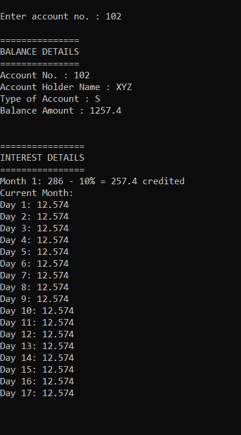

## Description

--> Designed a complete banking system using the concepts of file handling and OOPS in C++.

--> The application is built using CodeBlocks in a Windows system.

--> The application calculates and credits the interests of all the accounts automatically on a monthly basis.

--> The time references for interest calculation and credit are fetched from the system time of the system on which the application is running.

--> Apart from this, the other regular banking operations such as deposit, withdrawal, balance enquiry, etc. can also be performed using this application.

## Application Demo Snapshots

